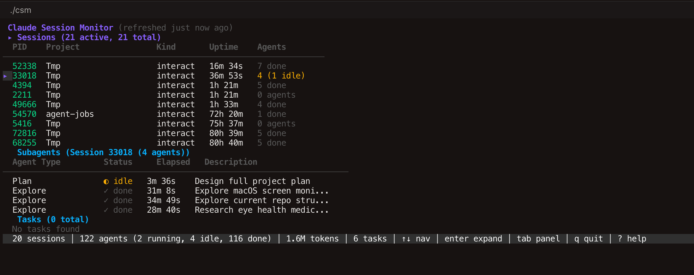

# Claude Session Monitor — v1.0

> Release Date: 2026-04-14
> Status: Superseded by v1.1

## Features

- Session list with PID, Project, Kind, Uptime, Agent count
- Subagent table with Agent Type, Status, Elapsed, Description
- Task list with Status, Subject, Dependencies
- Inline detail expansion (Enter key)
- fsnotify + 2s polling auto-refresh
- Summary bar with aggregate metrics

## Known Issues (from review)

- Sessions all show "Tmp" — no topic differentiation
- Missing token usage in session table
- Agent description truncated
- No model info per agent
- No tool call summary

## Screenshot

See: `/Users/mengxionghan/.claude/image-cache/cc7b2bf4-d66e-4fda-a240-6c57c1e0fd4a/2.png`
