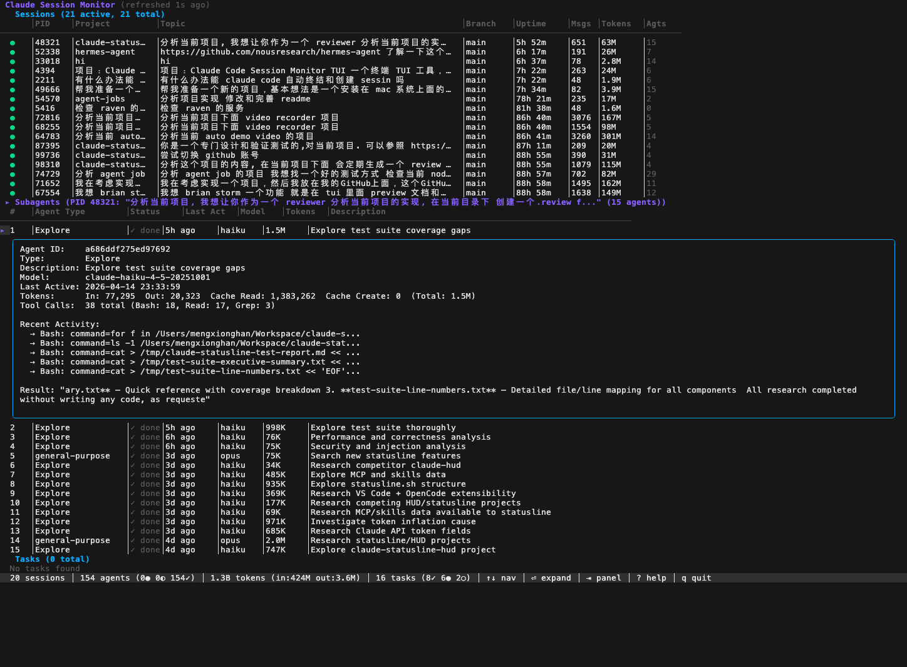

# Version 1.2 — UX Polish & Data Quality

**Date:** 2026-04-15
**Iterations:** 5–7 (of 20)
**Commit:** 4e5af6c

## Screenshot

## Changes from v1.1

### Session Panel
- **Status indicator column** — Green `●` for alive, dim `○` for dead processes
- **Message count column** — Shows total user messages per session (e.g., 651, 191)
- **Smart project name resolution** — Generic dirs like `Tmp`, `projects`, `Desktop` are skipped; falls back to parent dir or topic-based name. URLs have repo names extracted (e.g., `hermes-agent` from GitHub URL).
- **Session sorting** — Alive sessions sorted first, then by start time descending (newest on top)

### Agent Panel
- **"Last Act" column** replaces "Elapsed" — Shows relative time since last JSONL write (`5h ago`, `3d ago`) instead of confusing absolute durations like `72h 48m`
- **Agent sorting** — Running agents first, then idle, then done. Within same status, most recently active first.
- **Improved detail expansion** (Enter key) — Now shows:
  - Agent ID, Type, Description, Full model name
  - Last Active timestamp (2026-04-14 23:33:59 format)
  - Token breakdown with total: `In: 77,295  Out: 20,323  Cache Read: 1,383,262  (Total: 1.5M)`
  - Tool call summary: `38 total (Bash: 18, Read: 17, Grep: 3)`
  - Recent Activity: last 5 tool calls with truncated input
  - Result text (sanitized, single-line)

### Task Panel
- **Proper CJK column alignment** using `runewidth` (was using `fmt %-Ns`)
- **Scroll offset** support for long task lists

### Summary Bar
- **Token breakdown** — `1.3B tokens (in:424M out:3.6M)` instead of just total
- **Task status counts** — `16 tasks (8✓ 6● 2○)`
- **Unicode key hints** — `⏎ expand │ ⇥ panel` for cleaner display

### Code Quality
- **Deduplication** — `refreshData()` and `applyResult()` shared 95% identical code; `refreshData()` now delegates to `applyResult()`
- **`FormatRelativeTime()`** — New function for "Xd ago" format, separate from `FormatUptime()` which is used for session uptime

## Known Issues
1. Some sessions show the same text in both Project and Topic columns when project name falls back to topic extraction
2. Very short topics like "hi" produce uninformative project names
3. All sessions showing as "active" — may need to verify PID detection in VHS sandbox context
